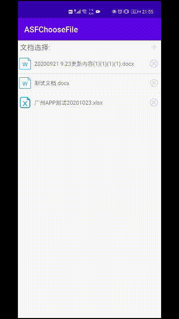

# ChooseFile
Android系统的文件选择和查看;在app进行先择文档的libary,通过接入TBS服务实现在app内部查看文档(适配了android10+的Scope Storage文件存储的及访问的新特性)。  
## 实现效果  
  
## 在项目中添加依赖  
* Gradle  
 1.Add it in your root build.gradle at the end of repositories:
```java  
allprojects {
    repositories {
    ...
    maven { url 'https://jitpack.io' }
    }
    }  
```  
2.Add the dependency  
```java  
dependencies {
    implementation 'com.github.hanjie511:ChooseFile:1.0.0'
  }  
```  
* Maven  
```java  
<repositories>
    <repository>
      <id>jitpack.io</id>
      <url>https://jitpack.io</url>
    </repository>
</repositories>
<dependency>
    <groupId>com.github.hanjie511</groupId>
    <artifactId>ChooseFile</artifactId>
    <version>1.0.0</version>
</dependency>  
```  
## 在项目中使用  
* Step1  在布局中引用
```java  
<com.example.mylibrary.ChooseDocumentView
  android:layout_width="match_parent"
  android:layout_height="match_parent"
  android:id="@+id/chooseDocumentView"
        />
        
```  
* Step2  在Activity中初始化并实现其接口和方法  
```java  
private ChooseDocumentView chooseDocumentView;
.  
.  
chooseDocumentView=findViewById(R.id.chooseDocumentView);
chooseDocumentView.setFileChangedListener(new ChooseDocumentView.FileChangedListener() {
  @Override
  public void getPathList(List<String> pathList) {
    //返回所选择文件的路径的回调方法
  }
  }); 
  
  @Override
  protected void onActivityResult(int requestCode, int resultCode, @Nullable Intent data) {//重写onActivityResult方法
    super.onActivityResult(requestCode, resultCode, data);
    chooseDocumentView.handleActivityResult(requestCode,resultCode,data);
    }

  @Override
  public void onRequestPermissionsResult(int requestCode, @NonNull String[] permissions, @NonNull int[] grantResults) {//onRequestPermissionsResult
    super.onRequestPermissionsResult(requestCode, permissions, grantResults);
    chooseDocumentView.handleRequestPermissionsResult(requestCode,permissions,grantResults);
    }
```  
* Step3 在引用项目的AndroidManifest.xml的application节点下添加provider  
```java  
<provider
  android:name="androidx.core.content.FileProvider"
  android:authorities="${applicationId}.provider"
  android:exported="false"
  android:grantUriPermissions="true">
   <meta-data
     android:name="android.support.FILE_PROVIDER_PATHS"
     android:resource="@xml/file_path" />
   </provider>
```
### 通过以上步骤，就可以实现在app选择文档和查看文档的功能啦。
## 封装的一些其他的方法（如果你不想使用选择文件的控件，你只想实现在app内查看文档，这些方法可能会帮到你）
#### openFileByUrl(String netWorkURL);//通过网络链接直接打开网络文档  
#### openFileByUri(Uri uri);//通过本地文档的Uri直接打开本地文档
#### openFileByAbsolutePath(String absolutePath);//通过本地文档的绝对路径直接打开本地文档
#### eg:  
```java  
public void downLoadFile(View v){
   chooseDocumentView.openFileByUrl("https://hanjie-oos.oss-cn-shenzhen.aliyuncs.com/%E6%B5%8B%E8%AF%95%E6%96%87%E6%A1%A3.docx");
    }
public void openUri(View v){
   chooseDocumentView.openFileByUri(MainActivity.this, Uri.parse("content://com.android.externalstorage.documents/document/primary%3AAndroid%2Fdata%2Fcom.tencent.mm%2FMicroMsg%2FDownload%2F%E6%B7%B1%E5%9C%B3%E9%A1%B9%E7%9B%AE%E8%BF%9B%E5%BA%A6.docx"));
    }
public void openAbsolute(View v){
   chooseDocumentView.openFileByAbsolutePath(MainActivity.this,"/storage/emulated/0/Android/data/com.example.asfchoosefile/files/Documents/深圳项目进度.docx");
    }
```  
### [TBS](https://x5.tencent.com) 


